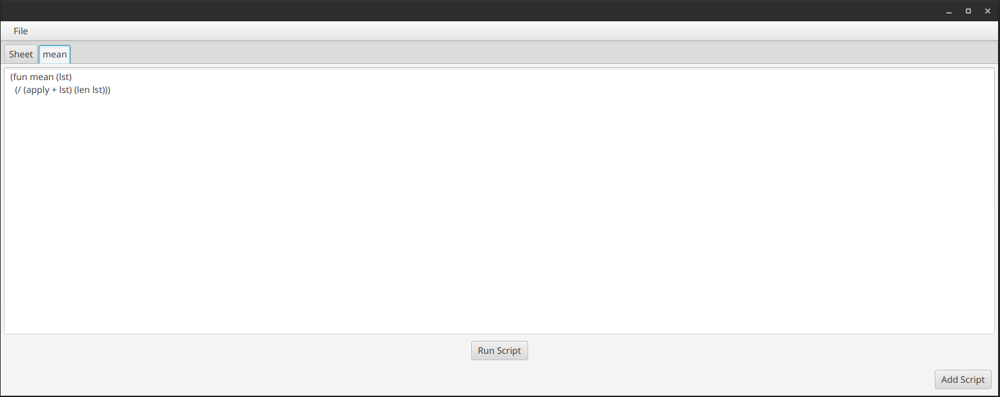

# Spready

Spready is a spreadsheet that uses a lisp interpreter for its formulas.

This project was meant to learn about how to implement a simple programming language
and to learn more about kotlin.




## Lisp

Spready supports most of the relevant functions from the
[R5RS](https://en.wikipedia.org/wiki/Scheme_(programming_language)#Review_of_standard_forms_and_procedures)
standard, but it sadly doesn't support macros.

More information about the data types and functions can be found in [lisp](./lisp.md).

## Run

You will probably need at least java 14 to run it because of [controlsfx](https://github.com/controlsfx/controlsfx/issues/1141).

Then just run:

```sh
./gradlew run
```

## Useful Resources

These two resources helped me to understand what parts are needed to implement the lisp interpreter.

- [(How to Write a (Lisp) Interpreter (in Python))](https://norvig.com/lispy.html)
- [KLisp](https://github.com/mrcdr/KLisp)
